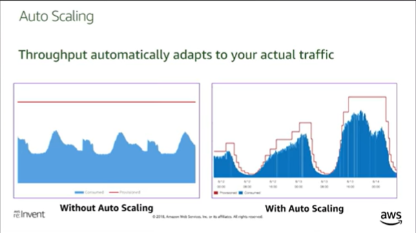
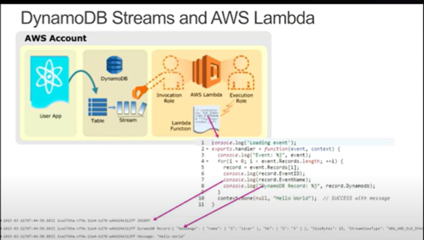
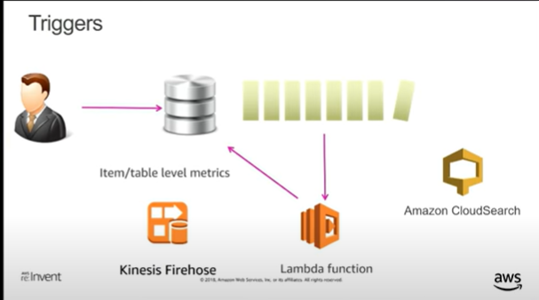
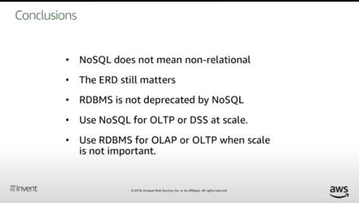

# DynamoDB

## Partition Key
1. Partition Key uniquely identifies an item
2. Allows table to be partitioned for scale (horizontally)
3. Used for building an unordered hash index
4. Partitions are 3-way replicated (across secondary)
4. Eventually consistent reads are cheaper.

## Sort Key (Range Key)
1. Within unordered hash index, data is arranged by the sort key.
2. Local secondary index is alternate sort key attribute
3. GSI is across all partition keys (RCUs and WCUs are provisioned separately GSIs)

## Performance

1. Distribute access patterns (Uniformly distribute partition keys)
2. Throughput automatically adapts to your actual traffic
3. Use CompositeKeys with range search where applicable (ex.: status & date becomes statusDate & perform a _beginsWith_ search)

> Create Tables where Partition Key element has large number of distinct values, and values are requested fairly uniformly, as randomly as possible.

### SQL vs. NoSQL Design Pattern

1. Relational: Products, Books, Albums, Tracks, ActorVideo, Actors
2. Document: Products (Books) or Order (OrderItems) [instead of these being two tables]
3. Avoid relational design patterns (as much as possible, single table with document as data)

## DynamoDB Streams

## Conclusion

